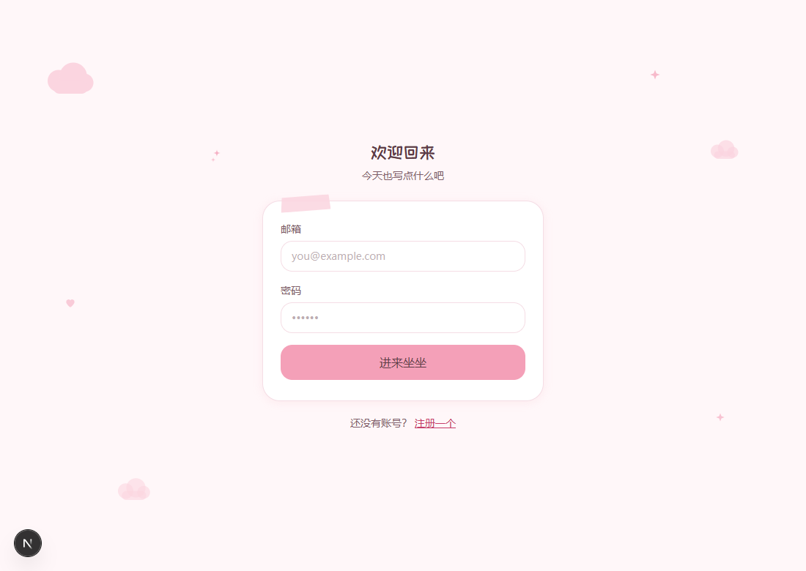
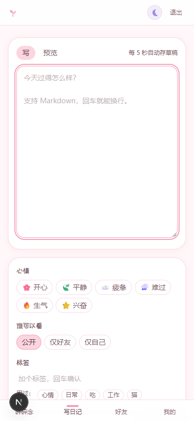
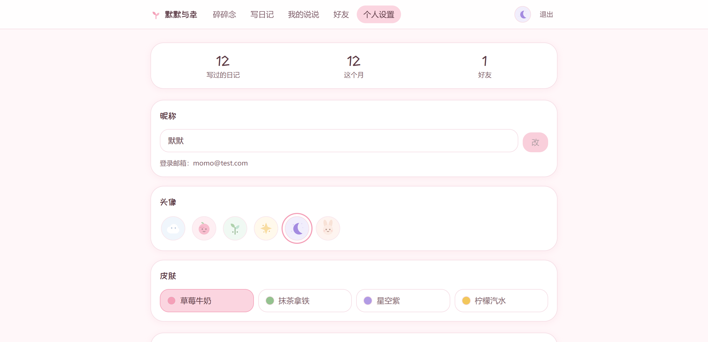
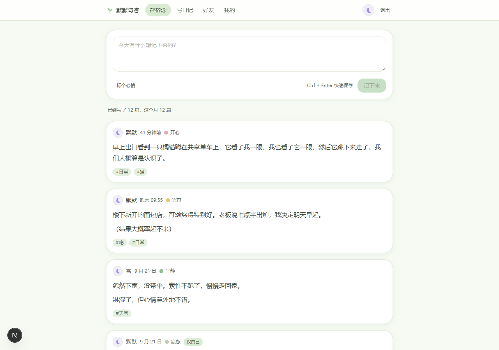

# 默默与幸（momo）

> 把碎碎念，轻轻放下。

一个软萌风格的多人日记站。注册后各自记录日常，可以只给自己看、给好友看，或者公开。

## 界面预览

| 登录 | 首页（移动端） |
|---|---|
|  |  |

| 写日记 | 我的 |
|---|---|
|  |  |

桌面端：

## 快速开始

```bash
npm install
npm run dev          # http://localhost:3000
```

首次启动会自动建库（`data/diary.db`）并建表。

想造点测试数据：

```bash
npm run db:seed      # 2 个用户互关 + 18 篇日记
```

默认账号（seed 出来的）：

| 邮箱 | 密码 |
|---|---|
| `momo@test.com` | `test123456` |
| `xing@test.com` | `test123456` |

注册需要邀请码，默认是 `momo`（`INVITE_CODES` 环境变量可改，格式 `码:次数`，`0` 表示不限次）。

## 功能

- **碎碎念**：首页一个速记框，想说什么直接写；想认真写就进编辑器，支持 Markdown 与实时预览
- **三档可见性**：公开 / 仅自己 / 仅好友
- **好友**：互相关注即成好友，「仅好友可见」的日记只有互关的人能看到
- **心情色卡**：6 种心情，颜色跟着皮肤走
- **标签**：给日记打标签，可按标签筛选
- **草稿**：编辑器每 5 秒自动存一次，关掉页面不丢
- **四套皮肤**：草莓牛奶 / 抹茶拿铁 / 星空紫 / 柠檬汽水
- **软删除**：删掉的日记是标记删除，不会让时间轴翻页跳行

## 技术栈

| 层 | 选型 | 为什么 |
|---|---|---|
| 框架 | Next.js 16 App Router + React 19 | 前后端一体，Server Component 直接查库 |
| 样式 | Tailwind CSS 4 | `@theme inline` 接 CSS 变量，换肤零成本 |
| 数据库 | better-sqlite3 | 单文件、同步 API、够快，不需要 ORM |
| 认证 | 自研 scrypt + 签名 Cookie | 不引 NextAuth，会话服务端可撤销 |
| 字体 | @fontsource/zcool-kuaile | 站酷快乐体，按 unicode-range 分片按需加载 |

## 几个关键设计

**权限判定在 SQL 里，不在代码里。** 三档可见性（公开 / 仅自己 / 仅好友）写成 SQL 条件
（`lib/repo/diary.ts` 的 `visibilityClause()`），任何查询天然带上权限约束，
不存在「忘了加判断」的可能。好友 = 双向 follows，用双 JOIN 判定。

**会话服务端可撤销。** `sessions` 表只存 `sha256(token)`，登出 / 封号 / 改密
立即失效。签名 Cookie 只是索引，不是凭证本身。

**鉴权守卫放 Server Component，不放 middleware。** Next 16 的 `middleware.ts`
跑在 Edge runtime，import 不了 better-sqlite3 和 node:crypto。
守卫在 `lib/guard.ts`。

**主题在 SSR 时写进 `<html data-theme>`。** 不用 localStorage，避免首屏闪烁（FOUC）。

**软删除（`deleted_at`）而不是物理删除。** 时间轴翻页时不会跳行。

## 改配色前先跑检查

```bash
npm run check:color   # 44 项「文字 / 背景」组合的 WCAG AA 对比度
npm run solve:color   # 找出满足 AA 且最接近原色的替代色值
```

马卡龙色天生明度高，很容易踩对比度坑（比如浅紫按钮托深色字只有 3.98:1）。
`--brand-deep` 是**文字链接色**，不是装饰色，所以看起来比 `--brand` 沉——这是刻意的。

检查脚本**直接从 `app/globals.css` 解析色值**，不在 Python 里另存一份。
改了 CSS 就重跑，别信任何硬编码副本（会出现「假绿」）。

## 目录

```
app/            页面与 API 路由
  api/          auth / diaries / drafts / tags / friends / me
  d/[id]/       日记详情
  tags/[name]/  标签筛选
components/     软萌原子组件（Button/Card/…）与业务组件
lib/
  schema.ts     建表 SQL（内嵌，不放独立 .sql）
  db.ts         连接单例 + 事务封装
  auth.ts       scrypt 哈希 / 会话 / 限流 / 审计
  repo/         数据访问层，权限判定在这
  config.ts     站名、皮肤、心情、可见性等常量
scripts/        seed 与配色检查
deploy/         备份 / 恢复脚本
docs/screenshots/ 界面截图
public/avatars/ 6 个手绘 SVG 头像
```

## 环境变量

都可选，不设也能跑：

| 变量 | 默认 | 说明 |
|---|---|---|
| `DIARY_DB_PATH` | `data/diary.db` | 数据库位置 |
| `SESSION_SECRET` | 自动生成到 `data/session.secret` | 会话签名密钥 |
| `INVITE_CODES` | `momo:0` | 邀请码，格式 `码:次数` |

站名在 `lib/config.ts` 里改（`SITE_NAME`）。

## 部署（Docker）

镜像已配好三阶段构建，一条命令即可：

```bash
cp .env.example .env            # 填入 SESSION_SECRET（openssl rand -hex 32）
docker compose up -d --build
```

默认监听 **5200** 端口，访问 `http://<服务器 IP>:5200`。

几个设计点：

- **数据持久化**：SQLite 库和会话密钥都在 `/app/data`，挂载到宿主机 `./data`。
  容器重建不丢数据，但**删掉 `./data` 就等于清库**。
- **非 root 运行**：容器内用 uid 1001 的 `momo` 用户，`/app/data` 已 chown 给它。
- **健康检查**：每 30 秒探一次 `/login`，连续失败 3 次标记 unhealthy。
- **日志限流**：json-file 驱动限制 10MB × 3 份，避免日志把盘写满。
- **better-sqlite3** 是原生模块，`deps` 阶段装 `python3 make g++` 现编，
  编译工具不会进最终镜像。
- `SESSION_SECRET` 没设时 compose 直接报错退出 —— 生产环境不该用随手生成的密钥。

常用运维命令：

```bash
docker compose logs -f          # 看日志
docker compose restart          # 重启
docker compose up -d --build    # 改完代码重新构建
docker compose down             # 停止（数据卷保留）
```

## 备份与恢复

### 为什么不能直接拷 `diary.db`

库跑在 **WAL 模式**（`lib/schema.ts` 里的 `PRAGMA journal_mode = WAL`）。实测部署后的现象：

```
diary.db        4096 字节    ← 只有文件头，几乎是个空壳
diary.db-shm   32768 字节    ← 共享内存索引
diary.db-wal  247232 字节    ← 表结构 + 数据实际都在这里
```

也就是说，**只拷 `diary.db` 会得到一个几乎是空的库，而且打开时不报错** ——
这是最危险的那种备份。必须让 SQLite 自己处理 WAL。

`deploy/backup.sh` 走的就是官方在线备份 API（better-sqlite3 的 `db.backup()`），
它已经在镜像里，不需要额外装 `sqlite3` 命令行工具。

### 备份

```bash
sh deploy/backup.sh              # 热备，不停机
KEEP=30 sh deploy/backup.sh      # 保留最近 30 份（默认 14）
```

产出 `/opt/momo/backups/diary-<时间戳>.db`，单个文件，直接拿走就能用。
脚本每次备份后会自动跑一遍 `integrity_check` 并打印表数 / 用户数 / 日记数 ——
没验过的备份等于没有备份。

同时会存一份 `.env`（`env-<时间戳>.bak`，权限 600）。它丢了不会丢数据，
但所有用户会被强制登出。

### 恢复

```bash
sh deploy/restore.sh /opt/momo/backups/diary-20260923-163000.db
```

会先把现有 `data/` 整体挪到 `data.before-restore-<时间戳>/` 留底，再换库。
脚本里有一条不能省：**清掉旧的 `-wal` / `-shm`** ——
带着不匹配的 WAL 启动，SQLite 可能按 WAL 里的旧数据把库覆盖回来。

### 定时备份

放在 `/etc/cron.d/momo-backup`，每天 04:00 跑一次：

```
0 4 * * * root sh /opt/momo/deploy/backup.sh > /var/log/momo-backup.log 2>&1
```

### 异地留一份

备份文件在服务器本地，服务器整个挂掉就一起没了。定期拉回本地：

```bash
python xssh.py get /opt/momo/backups/diary-<时间戳>.db ./ --confirm
```

